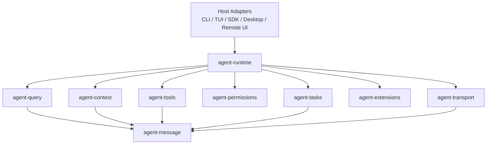

# 新一代 Code Agent 架构规范总览

## 文档状态

- 状态：Proposed
- 日期：2026-04-02
- 依据：基于 `分析报告/` 既有审计报告系列收束形成的实现规范

## 目标

本规范用于指导“基于 Rust 编写的全新一代 Code Agent 项目”的顶层设计、核心决策与模块划分。它不是现有 Claude Code 的代码翻译稿，也不是 PRD，而是一套面向实现的架构约束文件。

本规范希望解决三个问题：

1. 新系统的架构边界是什么。
2. 哪些关键决策必须被固定，不能在实现阶段随意漂移。
3. 各模块的接口、职责、依赖方向和替换边界是什么。

## 适用范围

本规范覆盖以下范围：

- 本地优先的 Code Agent 运行时
- 消息驱动的查询与工具执行内核
- 上下文、记忆、压缩与缓存稳定性体系
- 权限、调度、隔离与恢复机制
- MCP、插件、技能、工作流等扩展能力
- 后台任务、分布式会话、远程桥接、多代理编排

本规范不覆盖以下内容：

- 具体 UI 外观与组件结构
- 具体模型供应商 SDK 的低层适配细节
- 与某个编辑器绑定的前端交互细节
- 某个具体部署平台的发布脚本

## 总体设计原则

### 原则一：先有运行时内核，再有宿主层

新系统必须先定义消息模型、查询状态机、工具调度器、权限内核和上下文引擎，然后再挂接 CLI、TUI、桌面端、远程控制端等宿主。

### 原则二：统一语义载体必须是消息流

用户输入、模型输出、工具调用、任务通知、系统事件、远程消息，都必须收敛为统一消息 IR。不能允许不同子系统各自维护不兼容的事件模型。

### 原则三：工具与任务分层必须清晰

工具是回合内能力调用，任务是跨回合或后台执行单元。二者不能混同，否则调度、恢复、权限和观测都会失真。

### 原则四：上下文是预算化资源

上下文、记忆和压缩必须被视为运行时资源管理问题，而不是提示词工程技巧。所有长期能力都必须接受 token 预算、缓存稳定性和压缩策略约束。

### 原则五：权限与安全必须进入内核

权限系统不能只是 UI 弹窗。规则加载、风险分析、工具放行、自动模式约束、后台代理权限行为，都必须由统一的权限内核控制。

### 原则六：扩展体系必须协议化

MCP、skills、plugins、workflows 必须统一进入标准能力模型，而不是直接拼接到主程序分支中。

### 原则七：分布式能力必须建立在本地内核稳定之后

Bridge、remote session、coordinator、多代理协同都应建立在稳定的本地 runtime 上，而不是先做远程分发，再补本地语义。

## 目标架构总图

## 规范包组成

本规范包包含以下 ADR 与接口文档：

1. [ADR-001-内核与宿主分层](./ADR-001-内核与宿主分层.md)
2. [ADR-002-消息模型与查询状态机](./ADR-002-消息模型与查询状态机.md)
3. [ADR-003-上下文与记忆系统](./ADR-003-上下文与记忆系统.md)
4. [ADR-004-权限内核与工具调度](./ADR-004-权限内核与工具调度.md)
5. [ADR-005-扩展协议与能力装配](./ADR-005-扩展协议与能力装配.md)
6. [ADR-006-分布式运行时与多代理协同](./ADR-006-分布式运行时与多代理协同.md)
7. [模块接口清单](./模块接口清单.md)

## 关键架构结论

### 结论一

新系统的核心交付物不是“新的命令行工具”，而是“新的 agent runtime kernel”。

### 结论二

Rust 适合承接的不是 UI，而是消息 IR、状态机、权限、安全、调度、恢复和压缩这些强约束逻辑。

### 结论三

系统必须天然支持本地会话、后台任务、远程会话和多代理协同四种运行形态，而不是将后两者作为附加功能。

### 结论四

模块之间必须保持明确依赖方向，尤其要避免：

- transport 反向依赖 query 内核
- UI 反向控制权限语义
- extension 直接修改 runtime 核心状态结构
- task runtime 与 tool runtime 混淆

## 与现有审计报告的关系

本规范不是独立于审计报告产生的抽象发散，而是基于以下文档收束得来：

- [分析报告/01-系统全景与顶层设计](../01-系统全景与顶层设计.md)
- [分析报告/02-运行主线与查询执行模型](../02-运行主线与查询执行模型.md)
- [分析报告/03-控制平面：命令-工具-任务-状态](../03-控制平面：命令-工具-任务-状态.md)
- [分析报告/04-上下文工程：提示-记忆-压缩-缓存](../04-上下文工程：提示-记忆-压缩-缓存.md)
- [分析报告/05-执行与安全：权限-并发-隔离-恢复](../05-执行与安全：权限-并发-隔离-恢复.md)
- [分析报告/06-扩展体系：MCP-插件-技能-工作流](../06-扩展体系：MCP-插件-技能-工作流.md)
- [分析报告/07-分布式与自治：Bridge-KAIROS-Coordinator](../07-分布式与自治：Bridge-KAIROS-Coordinator.md)
- [分析报告/08-Rust重构蓝图](../08-Rust重构蓝图.md)

## 阅读顺序

建议按以下顺序使用本规范：

1. 先读本总览，建立整体边界。
2. 再读 ADR-001 和 ADR-002，确定最核心运行时形态。
3. 然后读 ADR-003 和 ADR-004，确定上下文与安全内核。
4. 再读 ADR-005 和 ADR-006，确定扩展面与分布式能力。
5. 最后用 [模块接口清单](./模块接口清单.md) 进入具体实现与 crate 划分。

## 采纳标准

实现团队在做详细设计或编码前，任何新模块、新宿主、新扩展都应回答以下问题：

1. 该能力属于哪个既有模块。
2. 它是否改变消息模型。
3. 它是否影响权限或调度语义。
4. 它是否引入新的上下文生命周期。
5. 它是否破坏依赖方向。

如果答案无法在当前规范内安置，应先补 ADR，再做实现。
